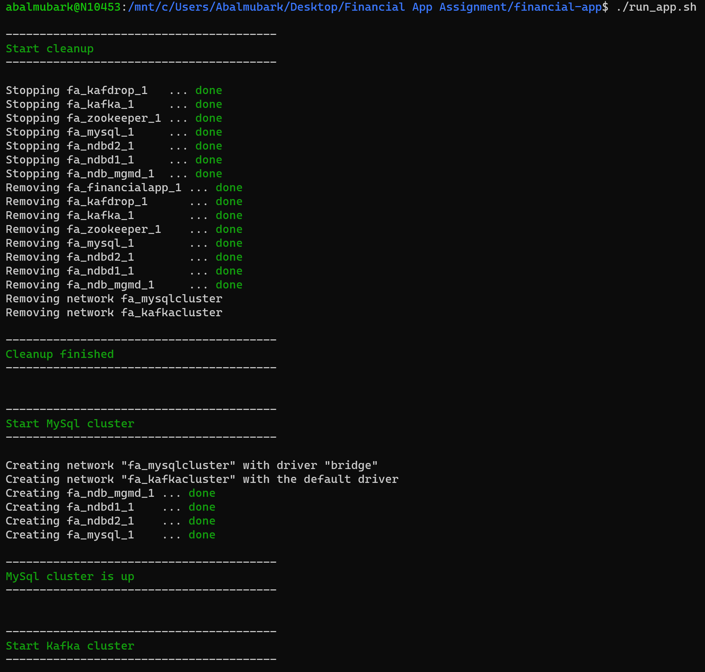

# Project assignment

Build a financial app using Akka,
It’s going to be a fake financial app, where we will be making (virtual) money. The application is composed of a set of components. Quote generator, traders and the auditor.
Each component is responsible for doing its job as the following:
- The quote generator - this is an absolutely unrealistic simulator that generates the quotes for 5 fictional companies. The market data is published on to a Kafka topic. Traders consume those data to know the current price.
- The traders - these are a set of components that receives quotes from the quote generator and decides whether or not to buy or sell a particular share. To make this decision, they rely on their current amount of money💰💰💰
- The audit -We need to keep a list of all our operations . The audit component receives operations from the Traders and address  It then stores theses in a database.
- The traders should have different criteria to buy and sell suggested by you, and you should show what was the best criteria for making money.



## Installation
You only need to have [docker](https://www.docker.com/products/docker-desktop) installed 

## Usage
Make sure you have [docker](https://www.docker.com/products/docker-desktop) running
- Open a bash terminal
- Run script found at the project root [run_app.sh](run_app.sh)
```bash
./run_app.sh
```
- [run_app.sh](run_app.sh) will start Kafka and MySql clusters and run the app for you
- You should see the following 
  

- Grab a cup of coffee and enjoy the show ☕

## Additional Info
#### Kafka cluster
- You can get an overview of kafka cluster using Kafdrop through http://localhost:9000/
  
#### MySql cluster
- You can get an overview of MySql cluster by running the following commands
```bash
docker exec -it fa_ndb_mgmd_1 bash
ndb_mgm
show
```
  
- You can access MySql database through localhost:3306 with the following credentials' username = admin, password = admin
## License
[MIT](https://choosealicense.com/licenses/mit/)